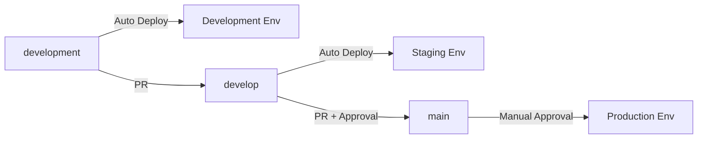

# Incident Platform - Multi-Environment Microservices

A comprehensive incident management platform built with Spring Boot microservices, supporting **Development**, **Staging**, and **Production** environments with full CI/CD integration.

## 🏗️ Architecture Overview

The platform consists of 11 microservices deployed across three distinct environments:

### Core Services
- **Gateway Service** - API Gateway with environment-specific routing
- **Discovery Server** - Service registry (Eureka)
- **Config Server** - Centralized configuration management
- **Auth Service** - Authentication and authorization
- **Log Collector** - Log aggregation and processing
- **Anomaly Detector** - ML-based anomaly detection
- **Alert Manager** - Alert processing and routing
- **Notification Service** - Multi-channel notifications
- **Auto Responder** - Automated incident response
- **Incident Tracker** - Incident lifecycle management
- **Dashboard Service** - Real-time monitoring dashboard
- **AI Service** - Machine learning and analytics

## 🌍 Environment Strategy

### Development Environment
- **Purpose**: Local development and feature testing
- **Branch**: `development`
- **Infrastructure**: Docker Compose
- **Database**: Local PostgreSQL/MongoDB instances
- **Monitoring**: Basic Prometheus setup
- **Security**: Minimal security for ease of development
- **Auto-deployment**: Yes, on every commit

### Staging Environment  
- **Purpose**: Integration testing and pre-production validation
- **Branch**: `develop`
- **Infrastructure**: Kubernetes cluster
- **Database**: Shared staging databases
- **Monitoring**: Full monitoring stack
- **Security**: Production-like security
- **Auto-deployment**: Yes, after successful tests

### Production Environment
- **Purpose**: Live production workloads
- **Branch**: `main`
- **Infrastructure**: High-availability Kubernetes
- **Database**: Replicated, backed-up production databases
- **Monitoring**: Full observability with alerting
- **Security**: Maximum security and compliance
- **Auto-deployment**: Manual approval required

## 🚀 Quick Start

### Prerequisites
- Docker & Docker Compose
- Java 21
- Maven 3.9+
- Python 3.8+ (for AI service)
- kubectl (for Kubernetes environments)
- Helm 3.12+

### Development Environment

1. **Clone the repository**
```bash
git clone https://github.com/atakanzaa/incident-platform.git
cd incident-platform
```

2. **Start development environment**
```bash
# Build and start all services
docker-compose -f docker-compose.development.yml up -d

# Check service health
docker-compose -f docker-compose.development.yml ps
```

3. **Access services**
- Gateway: http://localhost:8080
- Dashboard: http://localhost:8088  
- Prometheus: http://localhost:9090
- RabbitMQ Management: http://localhost:15672 (admin/admin123)

### Staging Environment

1. **Deploy to Kubernetes**
```bash
# Apply staging configuration
kubectl apply -f argocd/applications/incident-platform-staging.yaml

# Monitor deployment
kubectl get pods -n incident-platform-staging
```

2. **Access staging services**
- Gateway: https://incident-platform-staging.your-domain.com
- Dashboard: https://dashboard-staging.your-domain.com
- Grafana: https://grafana-staging.your-domain.com

### Production Environment

1. **Deploy via CI/CD pipeline** (Recommended)
```bash
# Push to main branch triggers production pipeline
git checkout main
git merge develop
git push origin main
```

2. **Manual deployment** (Emergency use)
```bash
# Apply production configuration (requires approval)
kubectl apply -f argocd/applications/incident-platform-production.yaml
```

## 📋 Environment Configuration

### Spring Profiles

Each service supports three Spring profiles:

```yaml
# Development
spring.profiles.active: development

# Staging  
spring.profiles.active: staging

# Production
spring.profiles.active: production
```

### Environment Variables by Environment

#### Development
```bash
SPRING_PROFILES_ACTIVE=development
DB_HOST=localhost
KAFKA_BOOTSTRAP_SERVERS=localhost:9092
RABBITMQ_HOST=localhost
REDIS_HOST=localhost
LOG_LEVEL=DEBUG
```

#### Staging
```bash
SPRING_PROFILES_ACTIVE=staging
DB_HOST=postgresql-staging
KAFKA_BOOTSTRAP_SERVERS=kafka-staging:9092
RABBITMQ_HOST=rabbitmq-staging
REDIS_HOST=redis-staging
LOG_LEVEL=INFO
```

#### Production
```bash
SPRING_PROFILES_ACTIVE=production
DB_HOST=${DB_HOST}
DB_PASSWORD=${DB_PASSWORD}
JWT_SECRET=${JWT_SECRET}
KAFKA_SASL_CONFIG=${KAFKA_SASL_CONFIG}
LOG_LEVEL=WARN
```

## 🔄 CI/CD Pipeline

### Pipeline Stages

1. **Initialization** - Environment detection and setup
2. **Checkout & Validation** - Code checkout and config validation
3. **Build & Test** - Maven build and Python environment setup
4. **Unit Tests** - Java and Python unit tests with coverage
5. **Integration Tests** - Environment-specific integration tests
6. **Code Quality & Security** - SonarQube, OWASP, container scanning
7. **Build Docker Images** - Multi-architecture image builds
8. **Environment Deployment** - Branch-based deployment strategy
9. **Post-Deployment Tests** - Health checks and smoke tests

### Branch Strategy



### Deployment Triggers

| Branch | Environment | Trigger | Approval |
|--------|-------------|---------|----------|
| `development` | Development | Auto | None |
| `develop` | Staging | Auto | None |
| `main` | Production | Auto | Required |

## 🛠️ Development Workflow

### 1. Feature Development
```bash
# Create feature branch from development
git checkout development
git checkout -b feature/your-feature-name

# Make changes and test locally
docker-compose -f docker-compose.development.yml up -d

# Commit and push
git add .
git commit -m "feat: add new feature"
git push origin feature/your-feature-name

# Create PR to development branch
```

### 2. Integration Testing
```bash
# Merge to develop for staging deployment
git checkout develop
git merge feature/your-feature-name
git push origin develop

# Monitor staging deployment
kubectl logs -f deployment/gateway-service -n incident-platform-staging
```

### 3. Production Release
```bash
# Create release PR from develop to main
git checkout main
git merge develop
git push origin main

# Approve production deployment in Jenkins
# Monitor production deployment
```

## 📊 Monitoring & Observability

### Development
- **Logs**: Docker Compose logs
- **Metrics**: Basic Prometheus
- **Health Checks**: Actuator endpoints

### Staging
- **Logs**: Centralized logging with ELK stack
- **Metrics**: Prometheus + Grafana
- **Tracing**: Jaeger distributed tracing
- **Alerts**: Basic alerting rules

### Production
- **Logs**: Centralized logging with retention
- **Metrics**: HA Prometheus with long-term storage
- **Tracing**: Full distributed tracing
- **Alerts**: Comprehensive alerting with PagerDuty
- **Backup**: Automated database backups
- **Monitoring**: 24/7 monitoring with SLA tracking

## 🔒 Security Configuration

### Development
- Minimal security for development ease
- No TLS requirements
- Debug logging enabled
- Open CORS policies

### Staging
- Production-like security settings
- TLS encryption
- Auth token validation
- Restricted CORS policies
- Security scanning in CI/CD

### Production
- Maximum security hardening
- Mutual TLS (mTLS)
- Encrypted secrets management
- Network policies
- Pod security policies
- Regular security audits
- Compliance monitoring

## 📦 Service Configuration

### Resource Allocation

| Environment | CPU Request | Memory Request | Replicas |
|-------------|-------------|---------------|----------|
| Development | 100m | 256Mi | 1 |
| Staging | 250m | 512Mi | 1-2 |
| Production | 500m | 1Gi | 2-10 |

### Database Configuration

#### Development
- **PostgreSQL**: Single instance, no persistence
- **MongoDB**: Single instance, no persistence
- **Redis**: Single instance, no persistence

#### Staging
- **PostgreSQL**: Single instance with persistence
- **MongoDB**: Replica set (3 nodes)
- **Redis**: Master-slave setup

#### Production
- **PostgreSQL**: Master-slave with read replicas
- **MongoDB**: Sharded cluster with replica sets
- **Redis**: Clustered setup with failover

## 🐳 Docker Configuration

### Environment-Specific Compose Files

```bash
# Development
docker-compose -f docker-compose.development.yml up -d

# Staging (for local staging testing)
docker-compose -f docker-compose.staging.yml up -d

# Production (for local production testing)
docker-compose -f docker-compose.production.yml up -d
```

## 🎯 Health Checks & Testing

### Health Endpoints
```bash
# Development
curl http://localhost:8080/actuator/health

# Staging
curl https://incident-platform-staging.your-domain.com/actuator/health

# Production
curl https://incident-platform.your-domain.com/actuator/health
```

### Running Tests by Environment

```bash
# Unit tests
mvn test -Dspring.profiles.active=development

# Integration tests
mvn test -Pintegration-tests -Dspring.profiles.active=staging

# Performance tests
mvn test -Pperformance-tests -Dspring.profiles.active=production
```

## 🚨 Troubleshooting

### Common Issues

1. **Service Discovery Issues**
```bash
# Check Eureka dashboard
curl http://discovery-server:8761/eureka/apps
```

2. **Database Connection Issues**
```bash
# Check database connectivity
kubectl exec -it deployment/auth-service -- nc -zv postgresql 5432
```

3. **Message Queue Issues**
```bash
# Check RabbitMQ status
kubectl exec -it deployment/rabbitmq -- rabbitmq-diagnostics status
```

### Environment-Specific Troubleshooting

#### Development
- Check Docker Compose logs: `docker-compose logs -f service-name`
- Verify port conflicts: `netstat -tulpn | grep :8080`

#### Staging/Production
- Check pod status: `kubectl get pods -n incident-platform-staging`
- View pod logs: `kubectl logs -f deployment/service-name`
- Check ArgoCD sync status: `argocd app get incident-platform-staging`

## 📚 Additional Resources

- [Service Documentation](./docs/services/)
- [API Documentation](./docs/api/)
- [Deployment Guide](./docs/deployment/)
- [Monitoring Guide](./docs/monitoring/)
- [Security Guide](./docs/security/)

## 🤝 Contributing

1. Fork the repository
2. Create your feature branch from `development`
3. Commit your changes
4. Push to your branch
5. Create a Pull Request to `development`

## 📄 License

This project is licensed under the MIT License - see the [LICENSE](LICENSE) file for details.
# Test change for pipeline

