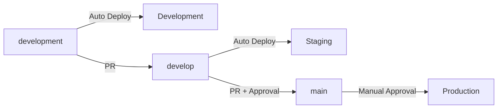

# Incident Platform

An AI-driven incident detection and response platform built on Spring Boot microservices and a Python ML service. The system ingests logs, detects anomalies, correlates alerts, executes automated responses, and tracks incidents through resolution across development, staging, and production environments.

---

## Table of Contents

- [Overview](#overview)
- [Architecture](#architecture)
- [Technology Stack](#technology-stack)
- [Prerequisites](#prerequisites)
- [Quick Start](#quick-start)
- [Environments](#environments)
- [Configuration](#configuration)
- [CI/CD Pipeline](#cicd-pipeline)
- [Development Workflow](#development-workflow)
- [Observability](#observability)
- [Security](#security)
- [Operations](#operations)
- [Troubleshooting](#troubleshooting)
- [Contributing](#contributing)
- [License](#license)

---

## Overview

The Incident Platform provides end-to-end incident lifecycle management: ingestion, detection, correlation, notification, response, and post-mortem tracking. It is designed for horizontal scalability on Kubernetes and for rapid iteration on a local Docker Compose stack.

Key capabilities:

- Centralized log collection and streaming via Kafka
- ML-based anomaly detection with a dedicated Python service
- Multi-channel alerting and notification routing
- Policy-driven automated remediation
- Incident tracking with audit trail
- Real-time dashboards and SLA monitoring

## Architecture

The platform is composed of 12 cooperating services orchestrated through a service registry, a centralized configuration server, and an API gateway.

### Platform Services

| Service | Responsibility |
| --- | --- |
| `config-server` | Centralized externalized configuration (Spring Cloud Config) |
| `discovery-server` | Service registry and discovery (Eureka) |
| `gateway-service` | API gateway, routing, authentication filters |
| `auth-service` | Authentication, authorization, JWT issuance |

### Domain Services

| Service | Responsibility |
| --- | --- |
| `log-collector-service` | Log ingestion and normalization |
| `anomaly-detector-service` | Streaming anomaly detection over normalized events |
| `alert-manager-service` | Alert deduplication, correlation, and routing |
| `notification-service` | Multi-channel delivery (email, webhook, chat) |
| `auto-responder-service` | Policy-based automated remediation |
| `incident-tracker` | Incident lifecycle and audit trail |
| `dashboard-service` | Operational dashboards and metrics APIs |
| `ai-service` | Python ML service for detection and analytics |

### Data and Messaging

- **PostgreSQL** — transactional data (auth, incidents, configuration)
- **MongoDB** — document storage for logs and enriched events
- **Redis** — caching, rate limiting, ephemeral state
- **Kafka** — event streaming backbone
- **RabbitMQ** — command and notification messaging

## Technology Stack

| Layer | Technology |
| --- | --- |
| Language (JVM) | Java 21 |
| Language (ML) | Python 3.8+ |
| Frameworks | Spring Boot 3.5, Spring Cloud 2025.0 |
| Build | Maven 3.9+ |
| Messaging | Apache Kafka 3.8, RabbitMQ 3.x |
| Storage | PostgreSQL 15, MongoDB 7, Redis 7 |
| Container | Docker, Docker Compose |
| Orchestration | Kubernetes, Helm 3.12+ |
| GitOps | Argo CD |
| CI/CD | Jenkins |
| Observability | Prometheus, Grafana, Jaeger, ELK |

## Prerequisites

- Docker and Docker Compose
- JDK 21
- Maven 3.9 or newer
- Python 3.8 or newer (for the AI service)
- `kubectl` and Helm 3.12+ (for Kubernetes deployments)

## Quick Start

### Local Development

```bash
git clone https://github.com/atakanzaa/incident-platform.git
cd incident-platform

docker-compose -f docker-compose.development.yml up -d
docker-compose -f docker-compose.development.yml ps
```

Default local endpoints:

| Component | URL | Credentials |
| --- | --- | --- |
| API Gateway | http://localhost:8080 | — |
| Dashboard | http://localhost:8088 | — |
| Prometheus | http://localhost:9090 | — |
| RabbitMQ Management | http://localhost:15672 | `admin` / `admin123` |

### Staging Deployment

```bash
kubectl apply -f argocd/applications/incident-platform-staging.yaml
kubectl get pods -n incident-platform-staging
```

### Production Deployment

Production is deployed through the CI/CD pipeline with manual approval. Emergency deployments can be applied directly:

```bash
kubectl apply -f argocd/applications/incident-platform-production.yaml
```

## Environments

| Environment | Branch | Infrastructure | Deployment | Approval |
| --- | --- | --- | --- | --- |
| Development | `development` | Docker Compose | Automatic on commit | None |
| Staging | `develop` | Kubernetes | Automatic after tests pass | None |
| Production | `main` | Highly available Kubernetes | Pipeline-driven | Required |

Each environment provides progressively stricter guarantees around security, availability, observability, and data durability.

### Resource Allocation

| Environment | CPU Request | Memory Request | Replicas |
| --- | --- | --- | --- |
| Development | 100m | 256Mi | 1 |
| Staging | 250m | 512Mi | 1–2 |
| Production | 500m | 1Gi | 2–10 |

### Data Tier

| Environment | PostgreSQL | MongoDB | Redis |
| --- | --- | --- | --- |
| Development | Single instance, ephemeral | Single instance, ephemeral | Single instance, ephemeral |
| Staging | Persistent single instance | Replica set (3 nodes) | Primary / replica |
| Production | Primary with read replicas | Sharded cluster with replica sets | Clustered with failover |

## Configuration

All services consume configuration from the Config Server and the active Spring profile.

### Spring Profiles

```yaml
spring.profiles.active: development   # local
spring.profiles.active: staging       # staging
spring.profiles.active: production    # production
```

### Environment Variables

Development:

```bash
SPRING_PROFILES_ACTIVE=development
DB_HOST=localhost
KAFKA_BOOTSTRAP_SERVERS=localhost:9092
RABBITMQ_HOST=localhost
REDIS_HOST=localhost
LOG_LEVEL=DEBUG
```

Staging:

```bash
SPRING_PROFILES_ACTIVE=staging
DB_HOST=postgresql-staging
KAFKA_BOOTSTRAP_SERVERS=kafka-staging:9092
RABBITMQ_HOST=rabbitmq-staging
REDIS_HOST=redis-staging
LOG_LEVEL=INFO
```

Production:

```bash
SPRING_PROFILES_ACTIVE=production
DB_HOST=${DB_HOST}
DB_PASSWORD=${DB_PASSWORD}
JWT_SECRET=${JWT_SECRET}
KAFKA_SASL_CONFIG=${KAFKA_SASL_CONFIG}
LOG_LEVEL=WARN
```

Secrets in staging and production are sourced from the cluster secret store and never committed to the repository.

## CI/CD Pipeline

The Jenkins pipeline progresses through the following stages:

1. Environment detection and workspace initialization
2. Checkout and configuration validation
3. Maven build and Python environment setup
4. Unit tests (Java and Python) with coverage
5. Environment-specific integration tests
6. Static analysis, dependency scanning, and container image scanning
7. Multi-architecture Docker image builds
8. Branch-based deployment to the target environment
9. Post-deployment health checks and smoke tests

### Branch Strategy


```mermaid
graph LR
    A[development] -->|Auto Deploy| B[Development]
    C[develop] -->|Auto Deploy| D[Staging]
    E[main] -->|Manual Approval| F[Production]

    A -->|PR| C
    C -->|PR + Approval| E
```

## Development Workflow

### Feature Development

```bash
git checkout development
git checkout -b feature/your-feature-name

docker-compose -f docker-compose.development.yml up -d

git add .
git commit -m "feat: add your feature"
git push origin feature/your-feature-name
```

Open a pull request targeting `development`.

### Promotion to Staging

```bash
git checkout develop
git merge feature/your-feature-name
git push origin develop

kubectl logs -f deployment/gateway-service -n incident-platform-staging
```

### Production Release

```bash
git checkout main
git merge develop
git push origin main
```

Approve the production deployment in Jenkins and monitor rollout.

### Testing

```bash
# Unit tests
mvn test -Dspring.profiles.active=development

# Integration tests
mvn verify -Pintegration-tests -Dspring.profiles.active=staging

# Performance tests
mvn test -Pperformance-tests -Dspring.profiles.active=production
```

### Health Checks

```bash
curl http://localhost:8080/actuator/health
curl https://incident-platform-staging.your-domain.com/actuator/health
curl https://incident-platform.your-domain.com/actuator/health
```

## Observability

| Capability | Development | Staging | Production |
| --- | --- | --- | --- |
| Logs | Docker Compose | Centralized (ELK) | Centralized with retention |
| Metrics | Prometheus (basic) | Prometheus + Grafana | HA Prometheus with long-term storage |
| Tracing | — | Jaeger | Jaeger (full coverage) |
| Alerts | — | Baseline rules | Full alerting with PagerDuty |
| Backups | — | Periodic | Automated with validation |
| SLA tracking | — | — | 24/7 with on-call rotation |

## Security

| Concern | Development | Staging | Production |
| --- | --- | --- | --- |
| Transport encryption | Disabled | TLS | Mutual TLS |
| Authentication | Lenient | Enforced | Enforced with short-lived tokens |
| CORS | Open | Restricted | Restricted allowlist |
| Secrets | Local env files | Cluster secret store | Cluster secret store + rotation |
| Network policies | — | Namespace-level | Namespace and pod-level |
| Scanning | — | CI pipeline | CI pipeline + runtime |
| Auditing | — | Basic | Full audit log and compliance review |

## Operations

### Docker Compose Files

```bash
docker-compose -f docker-compose.development.yml up -d
docker-compose -f docker-compose.staging.yml up -d
docker-compose -f docker-compose.production.yml up -d
```

### Service Logs

```bash
# Docker Compose
docker-compose -f docker-compose.development.yml logs -f <service>

# Kubernetes
kubectl logs -f deployment/<service> -n incident-platform-staging
```

### Argo CD

```bash
argocd app get incident-platform-staging
argocd app sync incident-platform-staging
```

## Troubleshooting

**Service discovery**

```bash
curl http://discovery-server:8761/eureka/apps
```

**Database connectivity**

```bash
kubectl exec -it deployment/auth-service -- nc -zv postgresql 5432
```

**Message broker status**

```bash
kubectl exec -it deployment/rabbitmq -- rabbitmq-diagnostics status
```

**Port conflicts (local)**

```bash
netstat -tulpn | grep :8080
```

## Contributing

1. Fork the repository.
2. Create a feature branch from `development`.
3. Commit your changes using [Conventional Commits](https://www.conventionalcommits.org/).
4. Push the branch and open a pull request into `development`.
5. Ensure the CI pipeline passes before requesting review.

For local setup details, see [DEVELOPMENT.md](./DEVELOPMENT.md). For anomaly detection test scenarios, see [ANOMALY_TESTING_GUIDE.md](./ANOMALY_TESTING_GUIDE.md).

## License

Released under the MIT License. See [LICENSE](LICENSE) for details.
